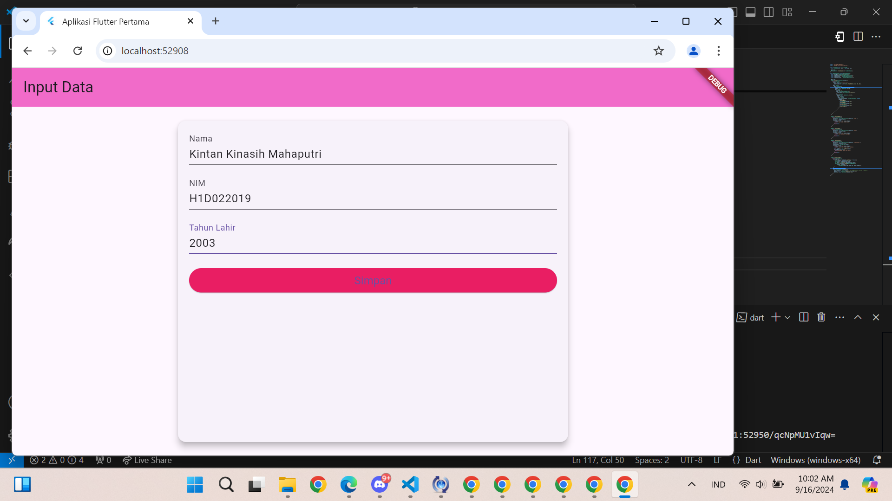
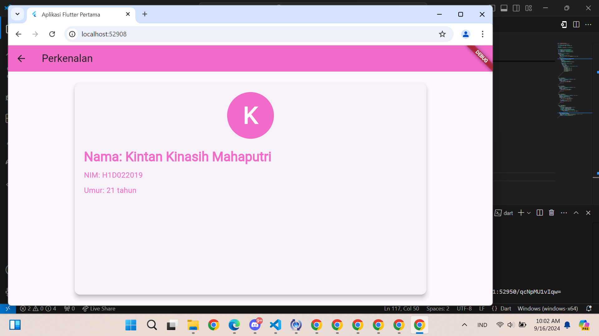

# Tugas Pertemuan 2
Nama : Kintan KInasih Mahaputri

NIM : H1D022019

Shift Baru: A

Langkah 1: Pengisian Data di Form (dibuat sbg komentar di code)
Pada file form_data.dart, terdapat FormData yang merupakan widget StatefulWidget. Widget ini berisi form untuk mengumpulkan data dari pengguna. Ada tiga field input yang didefinisikan: Nama, NIM, dan Tahun Lahir.
1. Deklarasi Controller:
  TextEditingController digunakan untuk mengambil input dari form
final _namaController = TextEditingController();
final _nimController = TextEditingController();
final _tahunController = TextEditingController();
2. Validasi Form:
  Setiap field input divalidasi menggunakan validator untuk memastikan data yang dimasukkan memenuhi kriteria:
validator: (value) {
  if (value == null || value.isEmpty) {
    return 'Nama tidak boleh kosong';
  }
  return null;
},
3. Tombol Simpan:
Ketika tombol "Simpan" ditekan, validasi form dilakukan. Jika form valid, data dari controller diambil dan diproses
onPressed: () {
  if (_formKey.currentState?.validate() ?? false) {
    String nama = _namaController.text;
    String nim = _nimController.text;
    int tahun = int.parse(_tahunController.text);
    Navigator.of(context).push(MaterialPageRoute(
        builder: (context) =>
            TampilData(nama: nama, nim: nim, tahun: tahun)));
  }
},

Langkah 2: Navigasi ke Tampilan Baru dengan Data (dibuat sbg komentar di code)
Ketika data telah divalidasi dan tombol "Simpan" ditekan, data dikirim ke TampilData menggunakan Navigator.of(context).push(). Berikut penjelasannya:

1. Pembuatan Rute:
MaterialPageRoute digunakan untuk membuat rute baru. Pada rute ini, TampilData diinisialisasi dengan data yang diambil dari form:
Navigator.of(context).push(MaterialPageRoute(
    builder: (context) =>
        TampilData(nama: nama, nim: nim, tahun: tahun)));
2. Passing Data:
   Data (nama, nim, tahun) diteruskan sebagai parameter ke widget TampilData:
class TampilData extends StatelessWidget {
  final String nama;
  final String nim;
  final int tahun;

  const TampilData({
    Key? key,
    required this.nama,
    required this.nim,
    required this.tahun,
  }) : super(key: key);
  
Langkah 3: Menampilkan Data di TampilData
Di file tampil_data.dart, widget TampilData menerima data dan menampilkannya:
1. Menerima Parameter:
   Data yang diteruskan dari FormData diterima oleh TampilData melalui konstruktor:
    const TampilData({
  Key? key,
  required this.nama,
  required this.nim,
  required this.tahun,
}) : super(key: key);
2. Menampilkan Data:
Data ditampilkan di UI dengan menggunakan widget seperti Text, CircleAvatar, dan lain-lain
Text(
  "Nama: $nama",
  style: Theme.of(context).textTheme.headlineMedium?.copyWith(
        fontWeight: FontWeight.bold,
        color: const Color.fromARGB(255, 241, 107, 201),
      ),
),

## Screenshot
Contoh :

